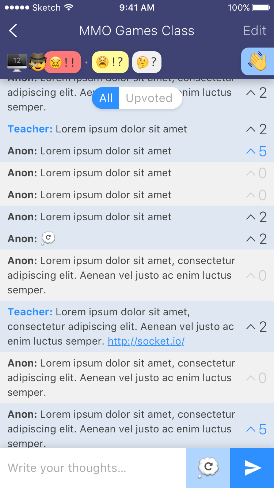

  

# OpenClass

Experiment to test the following hypothesis:

> Students are more likely to ask questions and express their doubts if they can do it:
- anonymously
- asynchronously

I will be testing this experiment during the 5th edition of my "Multiplayer Online Games with Node.js" course at Polytechnic University of Catalonia, which will take place in February

This prototype is __still under development__.

## License

MIT © [David da Silva]

[David da Silva]: https://dasilvacont.in
